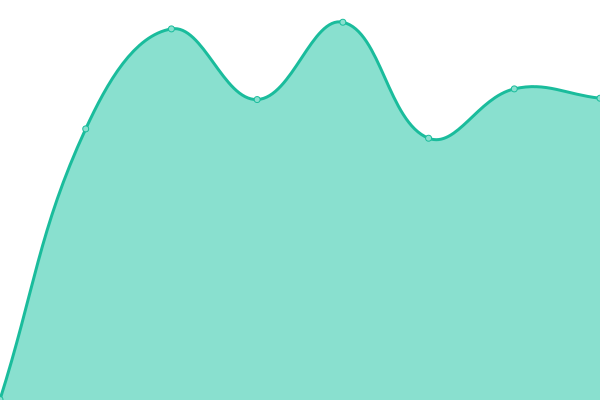
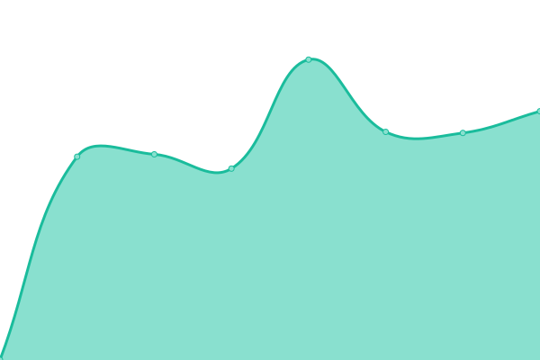
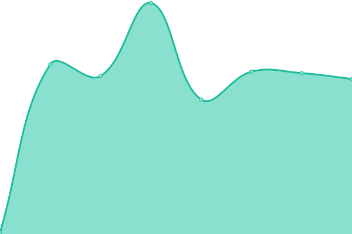
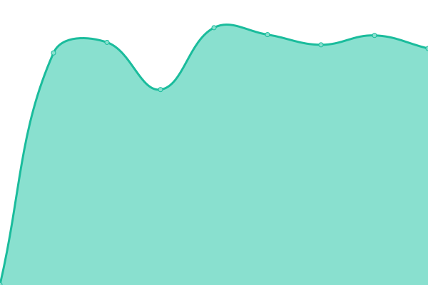
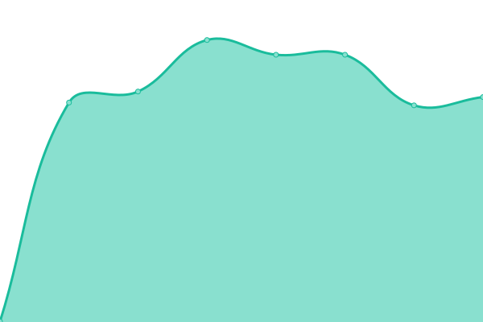
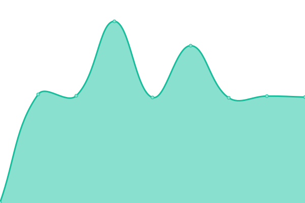

# [📈 Live Status](https://oetztal.github.io/upptime-infra): <!--live status--> **🟩 All systems operational**

This repository contains the open-source uptime monitor and status page powered by [Upptime](https://github.com/upptime/upptime).

With [Upptime](https://upptime.js.org), you can get your own unlimited and free uptime monitor and status page, powered entirely by a GitHub repository. We use [Issues](https://github.com/wuan/upptime/issues) as incident reports, [Actions](https://github.com/wuan/upptime/actions) as uptime monitors, and [Pages](https://demo.upptime.js.org) for the status page.

<!--start: status pages-->
<!-- This summary is generated by Upptime (https://github.com/upptime/upptime) -->
<!-- Do not edit this manually, your changes will be overwritten -->
<!-- prettier-ignore -->
| URL | Status | History | Response Time | Uptime |
| --- | ------ | ------- | ------------- | ------ |
|  Main Web | 🟩 Up | [main-web.yml](https://github.com/oetztal/upptime-infra/commits/HEAD/history/main-web.yml) | 

 831ms
     
 | 

<a href="https://oetztal.github.io/upptime-infra/history/main-web">94.61%</a>
    

|  Topic1 Web | 🟩 Up | [topic1-web.yml](https://github.com/oetztal/upptime-infra/commits/HEAD/history/topic1-web.yml) | 

 995ms
     
 | 

<a href="https://oetztal.github.io/upptime-infra/history/topic1-web">94.61%</a>
    

|  Web | 🟩 Up | [web.yml](https://github.com/oetztal/upptime-infra/commits/HEAD/history/web.yml) | 

 644ms
     
 | 

<a href="https://oetztal.github.io/upptime-infra/history/web">94.61%</a>
    

|  Cloud | 🟩 Up | [cloud.yml](https://github.com/oetztal/upptime-infra/commits/HEAD/history/cloud.yml) | 

 1344ms
     
 | 

<a href="https://oetztal.github.io/upptime-infra/history/cloud">94.61%</a>
    

|  Git | 🟩 Up | [git.yml](https://github.com/oetztal/upptime-infra/commits/HEAD/history/git.yml) | 

 958ms
     
 | 

<a href="https://oetztal.github.io/upptime-infra/history/git">94.61%</a>
    

|  Mail | 🟩 Up | [mail.yml](https://github.com/oetztal/upptime-infra/commits/HEAD/history/mail.yml) | 

 635ms
     
 | 

<a href="https://oetztal.github.io/upptime-infra/history/mail">94.61%</a>
    

|  Mail Submission | 🟩 Up | [mail-submission.yml](https://github.com/oetztal/upptime-infra/commits/HEAD/history/mail-submission.yml) | 

 129ms
     
 | 

<a href="https://oetztal.github.io/upptime-infra/history/mail-submission">94.70%</a>
    

|  Mail IMAP | 🟩 Up | [mail-imap.yml](https://github.com/oetztal/upptime-infra/commits/HEAD/history/mail-imap.yml) | 

 107ms
     
 | 

<a href="https://oetztal.github.io/upptime-infra/history/mail-imap">94.70%</a>
    

|  XMPP | 🟩 Up | [xmpp.yml](https://github.com/oetztal/upptime-infra/commits/HEAD/history/xmpp.yml) | 

 109ms
     
 | 

<a href="https://oetztal.github.io/upptime-infra/history/xmpp">94.70%</a>
    

|  Metrics | 🟩 Up | [metrics.yml](https://github.com/oetztal/upptime-infra/commits/HEAD/history/metrics.yml) | 

 197ms
     
 | 

<a href="https://oetztal.github.io/upptime-infra/history/metrics">94.70%</a>
    

|  Pad | 🟩 Up | [pad.yml](https://github.com/oetztal/upptime-infra/commits/HEAD/history/pad.yml) | 

 553ms
     
 | 

<a href="https://oetztal.github.io/upptime-infra/history/pad">93.58%</a>
    

|  Documentation | 🟩 Up | [documentation.yml](https://github.com/oetztal/upptime-infra/commits/HEAD/history/documentation.yml) | 

 638ms
     
 | 

<a href="https://oetztal.github.io/upptime-infra/history/documentation">94.70%</a>
    

|  Wiki | 🟩 Up | [wiki.yml](https://github.com/oetztal/upptime-infra/commits/HEAD/history/wiki.yml) | 

 821ms
     
 | 

<a href="https://oetztal.github.io/upptime-infra/history/wiki">94.70%</a>
    

|  SSO | 🟩 Up | [sso.yml](https://github.com/oetztal/upptime-infra/commits/HEAD/history/sso.yml) | 

 554ms
     
 | 

<a href="https://oetztal.github.io/upptime-infra/history/sso">94.70%</a>
    

<!--end: status pages-->

[**Visit our status website →**](https://oetztal.github.io/upptime-infra)

## 📄 License

- Powered by: [Upptime](https://github.com/upptime/upptime)
- Code: [MIT](./LICENSE) © [Anand Chowdhary](https://anandchowdhary.com), supported by [Pabio](https://pabio.com)
- Data in the `./history` directory: [Open Database License](https://opendatacommons.org/licenses/odbl/1-0/)
