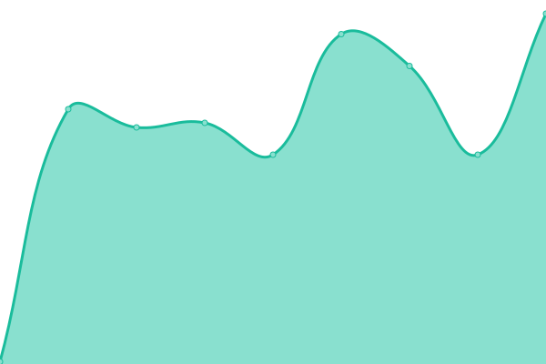

# [📈 Live Status](https://demo.upptime.js.org): <!--live status--> **🟧 Partial outage**

This repository contains the open-source uptime monitor and status page powered by [Upptime](https://github.com/upptime/upptime).

With [Upptime](https://upptime.js.org), you can get your own unlimited and free uptime monitor and status page, powered entirely by a GitHub repository. We use [Issues](https://github.com/wuan/upptime/issues) as incident reports, [Actions](https://github.com/wuan/upptime/actions) as uptime monitors, and [Pages](https://demo.upptime.js.org) for the status page.

<!--start: status pages-->
<!-- This summary is generated by Upptime (https://github.com/upptime/upptime) -->
<!-- Do not edit this manually, your changes will be overwritten -->
<!-- prettier-ignore -->
| URL | Status | History | Response Time | Uptime |
| --- | ------ | ------- | ------------- | ------ |
|  Main Web | 🟥 Down | [main-web.yml](https://github.com/oetztal/upptime-infra/commits/HEAD/history/main-web.yml) | 

 720ms
     
 | 

<a href="https://oetztal.github.io/upptime-infra/history/main-web">98.15%</a>
    

|  Topic1 Web | 🟥 Down | [topic1-web.yml](https://github.com/oetztal/upptime-infra/commits/HEAD/history/topic1-web.yml) | 

 639ms
     
 | 

<a href="https://oetztal.github.io/upptime-infra/history/topic1-web">98.32%</a>
    

|  Web | 🟥 Down | [web.yml](https://github.com/oetztal/upptime-infra/commits/HEAD/history/web.yml) | 

 636ms
     
 | 

<a href="https://oetztal.github.io/upptime-infra/history/web">98.33%</a>
    

|  Cloud | 🟥 Down | [cloud.yml](https://github.com/oetztal/upptime-infra/commits/HEAD/history/cloud.yml) | 

 1653ms
     
 | 

<a href="https://oetztal.github.io/upptime-infra/history/cloud">98.34%</a>
    

|  Git | 🟥 Down | [git.yml](https://github.com/oetztal/upptime-infra/commits/HEAD/history/git.yml) | 

 934ms
     
 | 

<a href="https://oetztal.github.io/upptime-infra/history/git">98.35%</a>
    

|  Mail | 🟥 Down | [mail.yml](https://github.com/oetztal/upptime-infra/commits/HEAD/history/mail.yml) | 

 685ms
     
 | 

<a href="https://oetztal.github.io/upptime-infra/history/mail">98.36%</a>
    

|  Mail Submission | 🟩 Up | [mail-submission.yml](https://github.com/oetztal/upptime-infra/commits/HEAD/history/mail-submission.yml) | 

 128ms
     
 | 

<a href="https://oetztal.github.io/upptime-infra/history/mail-submission">98.40%</a>
    

|  Mail IMAP | 🟩 Up | [mail-imap.yml](https://github.com/oetztal/upptime-infra/commits/HEAD/history/mail-imap.yml) | 

 125ms
     
 | 

<a href="https://oetztal.github.io/upptime-infra/history/mail-imap">98.44%</a>
    

|  XMPP | 🟩 Up | [xmpp.yml](https://github.com/oetztal/upptime-infra/commits/HEAD/history/xmpp.yml) | 

 125ms
     
 | 

<a href="https://oetztal.github.io/upptime-infra/history/xmpp">98.47%</a>
    

|  Metrics | 🟩 Up | [metrics.yml](https://github.com/oetztal/upptime-infra/commits/HEAD/history/metrics.yml) | 

 194ms
     
 | 

<a href="https://oetztal.github.io/upptime-infra/history/metrics">98.48%</a>
    

|  Pad | 🟩 Up | [pad.yml](https://github.com/oetztal/upptime-infra/commits/HEAD/history/pad.yml) | 

 612ms
     
 | 

<a href="https://oetztal.github.io/upptime-infra/history/pad">98.49%</a>
    

|  Documentation | 🟩 Up | [documentation.yml](https://github.com/oetztal/upptime-infra/commits/HEAD/history/documentation.yml) | 

 536ms
     
 | 

<a href="https://oetztal.github.io/upptime-infra/history/documentation">98.50%</a>
    

|  Wiki | 🟩 Up | [wiki.yml](https://github.com/oetztal/upptime-infra/commits/HEAD/history/wiki.yml) | 

 719ms
     
 | 

<a href="https://oetztal.github.io/upptime-infra/history/wiki">98.50%</a>
    

|  SSO | 🟩 Up | [sso.yml](https://github.com/oetztal/upptime-infra/commits/HEAD/history/sso.yml) | 

 489ms
     
 | 

<a href="https://oetztal.github.io/upptime-infra/history/sso">98.51%</a>
    

<!--end: status pages-->

[**Visit our status website →**](https://oetztal.github.io/upptime-infra)

## 📄 License

- Powered by: [Upptime](https://github.com/upptime/upptime)
- Code: [MIT](./LICENSE) © [Anand Chowdhary](https://anandchowdhary.com), supported by [Pabio](https://pabio.com)
- Data in the `./history` directory: [Open Database License](https://opendatacommons.org/licenses/odbl/1-0/)
